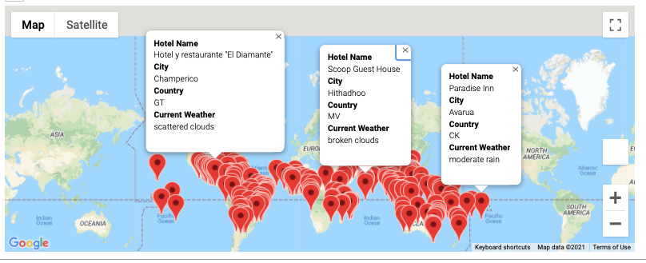
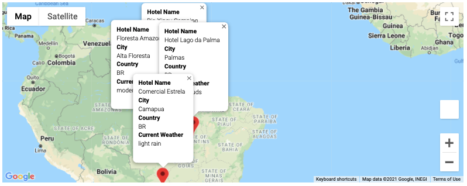
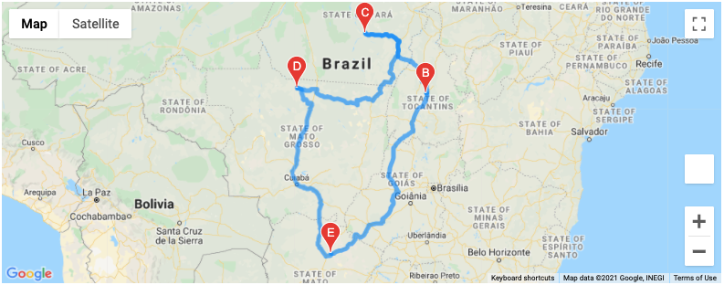

# World_Weather_Analysis

This repo containts c

Using APIs to access weather data and analyze it using pandas. 

This repository maintains code for a travel planner & recommendation tool. The project takes into consideration the users input of weather, specifically the tempurate of the destination and then recommends multiple cities and hotels which meet the criteria, the tool also helps users create a round trip itinerary. 

Sample screenshots of the application:

- User Screen to input temperature range

- Search recommendations based on User inputs

- Travel itinerary 

- Travel itinerary directions

